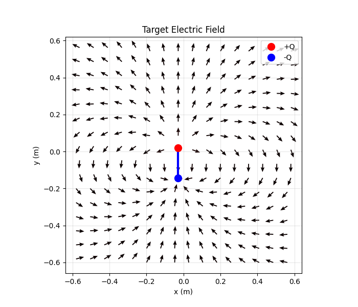
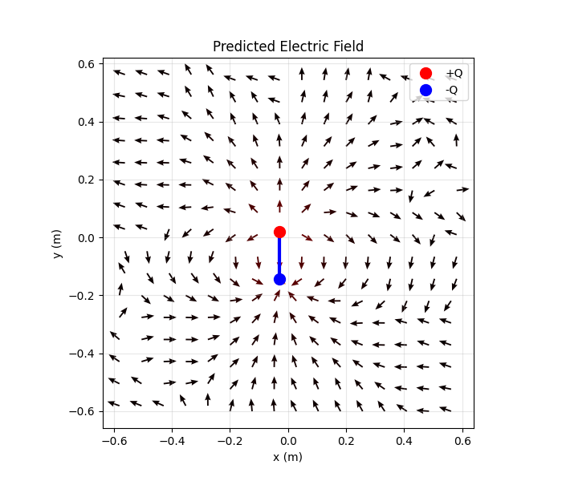

# Dipole Electric Field Surrogate Model

Neural network surrogate model for predicting the 2D electric field generated by a dipole antenna using physics-informed synthetic data.

## Problem

Given:
- Dipole length L
- Dipole center (x₀, y₀)
- Applied voltage V
- Spatial coordinates (x, y)

Predict:
- Electric field components (Eₓ, Eᵧ)

The dataset is generated analytically using Coulomb's law and dipole superposition.

## Physics Background

The electric field is computed as the superposition of two point charges:

E = kQ (r - r₀) / |r - r₀|³

where Q ∝ V × L.

## ML Formulation

Input features:
[L, x₀, y₀, V, x, y]  → 6D

Output:
[Eₓ, Eᵧ] → 2D

Model:
Fully connected neural network (MLP)

## In-Distribution Predictions

The model performs very well on data within the training distribution. Below is an example of the predicted field compared to the ground truth:

  
  

The model accurately captures both the magnitude and direction of the electric field vectors.

## Out-of-Distribution Predictions

To test generalization, we evaluated the model on a grid outside the training range ([-0.6, 0.6] m instead of [-0.3, 0.3] m). As expected, the predictions degrade when extrapolating beyond the training distribution:

  
  

This demonstrates that while the surrogate model captures the general field pattern, **extrapolation is challenging**.  

## Physics-Informed Extension

Incorporating physics constraints, such as enforcing \(\nabla \cdot \mathbf{E} = 0\), could improve generalization and reduce errors in out-of-distribution scenarios. Physics-informed losses guide the model to respect fundamental laws even when input conditions are unseen during training.
