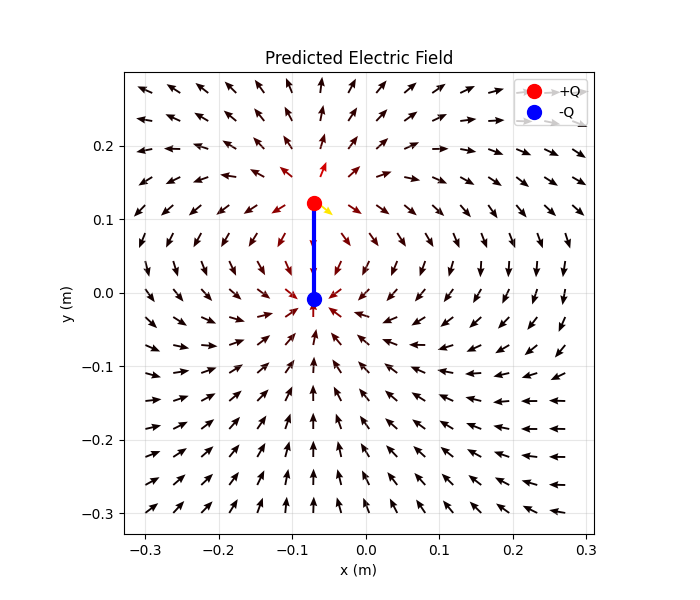

# Dipole Electric Field Surrogate Model

Neural network surrogate model for predicting the 2D electric field generated by a dipole antenna using physics-informed synthetic data.

## Problem

Given:
- Dipole length L
- Dipole center (x₀, y₀)
- Applied voltage V
- Spatial coordinates (x, y)

Predict:
- Electric field components (Eₓ, Eᵧ)

The dataset is generated analytically using Coulomb's law and dipole superposition.

## Physics Background

The electric field is computed as the superposition of two point charges:

E = kQ (r - r₀) / |r - r₀|³

where Q ∝ V × L.

## ML Formulation

Input features:
[L, x₀, y₀, V, x, y]  → 6D

Output:
[Eₓ, Eᵧ] → 2D

Model:
Fully connected neural network (MLP)

## Results

  
  

